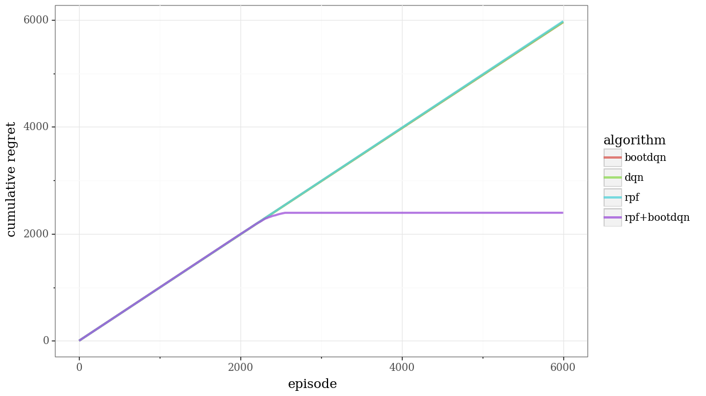

# rpf-pytorch
This is my [PyTorch](https://pytorch.org/) re-implementaion of the code accompanying the paper
[Randomized Prior Functions for Deep Reinforcement Learning](https://arxiv.org/abs/1806.03335)
.

You can play with it in
[this google collaboratory link](https://colab.research.google.com/github/kngwyu/rpf-pytorch/blob/master/rpf_pytorch.ipynb)
.

Contents are almost the same as the original one, but I added some additional
exeperiments, like RPF without BootDQN.

You can find the original notebook in the original
[project page](https://sites.google.com/corp/view/randomized-prior-nips-2018/home).
The original code is clear and quite readable, but unfortunately doesn't work without
modification because of a dependency problem around `pip install git+`
:cry:

## Main result
Here is the performance of ε-greedy/BootDQN/RPF/RPF+BootDQN in 20x20 DeepSea.

## Caveats
My RPF+BootDQN implementaion works well and cumulative regret stops
increasing.
But the performance is somewhat **a bit poorer** than the author's
result left in their notebook.

And **the result looks unstable** in that the number of episodes
needed to converge on the optimal policy varys siginificanly
(2000~3000 episodes).

There's some possible reasons for that, say,
- My implementaion is incorrect
- Some minor design choices(like NN initialization)

But I think this result shows **we must get lucky** for suceeding in
exploration, even if we use nice exploration-exploitation algorithms
such as RPF.
